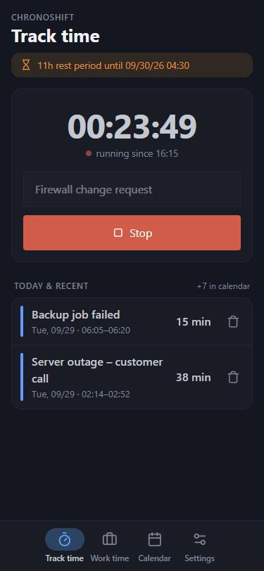
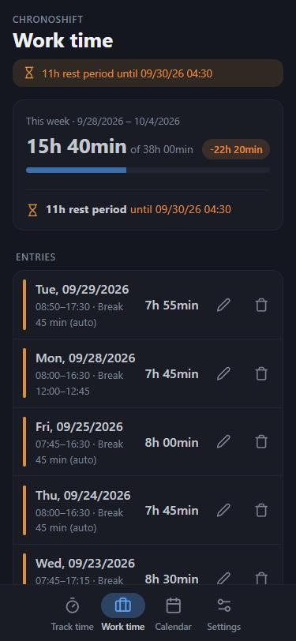
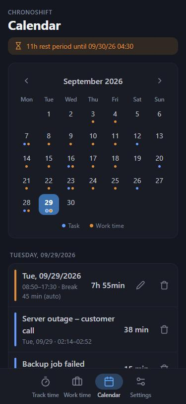
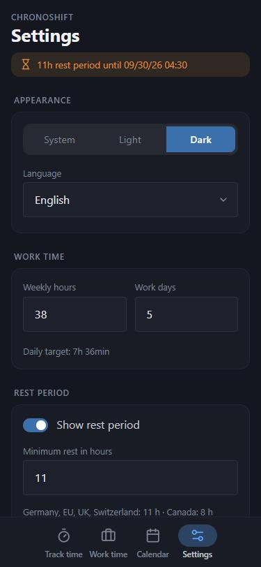

# ChronoShift

A fast, private time tracker for your phone. Track tasks with one tap, log your working hours and keep an eye on your legal rest period – all stored locally on your device, no account, no cloud.

Built as a Progressive Web App (PWA): open it in the browser, install it to your home screen and use it offline like a native app.

**Version:** 1.0.12-beta

👉 **Use it now:** https://cht47.github.io/chronoshift/

<p align="center">
  
  
  
  
</p>

## ✨ Features

### ⏱️ Track time
- Start a task with one tap (or press Enter on the keyboard)
- Live timer while a task is running – it keeps running even if you close the app
- Shows today's tasks and at least the two most recent ones; older entries are in the calendar
- Made for quick use, e.g. logging on-call jobs or project time

### 💼 Work time
- Log start and end of your working day, editable at any time
- Breaks either entered manually (exact from–to times) or deducted automatically
- Configurable automatic break rules that add up (default as required by German law: 30 min after 6 h, another 15 min after 9 h)
- Night shifts across midnight are supported
- Overlapping entries can be saved (e.g. while correcting times), but are highlighted in red and not counted twice in the weekly total
- Weekly overview with progress bar: actual hours vs. weekly target and the difference
- Difference to the daily target for each day; work on days off counts entirely as overtime

### 😴 Rest period
- Shows when your minimum rest period ends, based on the latest task or working day
- Duration is configurable (e.g. 11 h in Germany/EU, UK, Switzerland; 8 h in Canada) or can be turned off completely
- Optional banner at the top, limited to a time window (e.g. only outside regular working hours)
- Work time entered in advance only counts once it has started

### 📅 Calendar
- Monthly overview with markers for tasks, work time and overlapping work time entries
- Monthly totals of work time and tasks below the calendar
- Tap a day to see its entries, delete them or edit work time

### ⚙️ Settings
- Light, dark or system theme
- German and English, following the device language by default
- Weekly hours and work days Mon–Sun (daily target is calculated)
- Backup and restore of all tasks, work time and settings as a JSON file; a reminder pops up at startup if there was no backup for 30 days (and then again every 30 days)
- Optional cloud backup to Google Drive: stored in a folder only ChronoShift can access, the latest 10 backups are kept
- Excel export (.xlsx) for tasks and work time (separately) – opens in Excel, Google Sheets, Numbers and LibreOffice
- Delete today's tasks, all tasks, work time older than 90 days, or reset everything (with a 5-second safety countdown)

## 📱 Installation

1. Open https://cht47.github.io/chronoshift/ in your browser.
2. Install it:
   - **Android (Chrome):** menu ⋮ → *Install app* / *Add to home screen*
   - **iPhone/iPad (Safari):** share button → *Add to Home Screen*
   - **Windows/macOS/Linux (Chrome, Edge):** install icon in the address bar
3. Done – the app now works offline.

## 🔒 Data & privacy

- All data is stored **only on your device** (browser `localStorage`). Nothing is sent to a server.
- The app loads no external resources: no CDN, no fonts, no tracking. The only exception is the optional Google Drive backup: the app connects to Google only when you tap one of its buttons.
- Storage is limited by the browser to about 5 MB – enough for many years of entries. Current usage is shown under *Settings*.
- **Clearing your browser data deletes all entries.** Create a backup under *Settings → Backup* regularly; it can be restored on any device. A task that is currently running is not part of the backup.
- The app asks the browser to keep its data even when storage runs low (persistent storage).
- Data is stored per browser and device and is not synced between devices.
- Full privacy policy: https://cht47.github.io/chronoshift/privacy.html

## 🛠️ Development

The app is plain HTML, CSS and JavaScript (ES modules) – no framework, no build step.

Serve the folder with any static web server, for example:

```bash
npx serve .
```

Then open the URL shown in the terminal (e.g. http://localhost:3000).

> **Note:** Opening `index.html` directly from disk (`file://`) is not supported. This is a browser security restriction, not a bug: browsers block loading local files such as the language files in `locales/`, and offline mode and installation only work over `http(s)://`.

### Project structure

| File | Purpose |
|---|---|
| `index.html` | Markup of all views and dialogs |
| `css/app.css` | App styles on top of Pico CSS |
| `js/app.js` | Entry point: startup, navigation, service worker registration |
| `js/config.js` | Version, storage keys, default settings, languages |
| `js/state.js`, `js/storage.js` | Shared app state and loading/saving in `localStorage` |
| `js/tasks.js`, `js/worktime.js`, `js/calendar.js`, `js/settings.js`, `js/data.js` | One module per area of the app |
| `js/rest.js`, `js/worktime-calc.js` | Rest period and work time calculations |
| `js/gdrive.js` | Google Drive cloud backup (sign-in and Drive API, loaded only when used) |
| `js/i18n.js`, `js/ui.js`, `js/util.js`, `js/icons.js`, `js/xlsx.js` | Translations and formatting, dialogs, helpers, icons, Excel export |
| `locales/*.json` | UI texts per language |
| `pico.min.css` | [Pico CSS](https://picocss.com) v2.0.6, bundled locally |
| `service-worker.js` | Offline support (network first, cache as fallback) |
| `manifest.json` | PWA manifest |
| `privacy.html` | Privacy policy (German and English) |
| `icon.svg` | App icon source, also used as favicon |
| `icon-*.png`, `apple-touch-icon.png` | App icons rendered from `icon.svg` (regular, Android maskable, iOS) |

### Releasing a new version
- Increase the version with every release, e.g. `1.0.1-beta` → `1.0.2-beta`, in two places:
  - `APP_VERSION` in `js/config.js` (shown in the settings)
  - `VERSION` in `service-worker.js` (renews the offline cache so every device picks up the update)
- If you add, rename or remove files that must work offline, also update `FILES_TO_CACHE` in `service-worker.js`.

## 🌍 Languages

The app ships with German and English. By default it follows the device language and falls back to English if that language is not available. It can be changed under *Settings*.

To add a language:
1. Copy `locales/en.json` to `locales/<code>.json` (e.g. `fr.json`) and translate the values. Keep the keys and `{placeholders}` unchanged.
2. Add the language to `LANGUAGES` in `js/config.js`, e.g. `fr: "Français"`.
3. Add the file to `FILES_TO_CACHE` in `service-worker.js` so it is available offline.

Texts missing from a translation automatically fall back to English.

## ✅ Compatibility

Current versions of Chrome, Edge, Firefox and Safari on desktop and mobile.

## 📄 License

ChronoShift is source-available under the MIT License with the Commons Clause (see [`LICENSE`](LICENSE)).

- ✅ Free to use, modify and share – privately and within companies
- ❌ Selling the software, or paid services based on it (e.g. hosting, customization, support), is not permitted

Third-party components (Pico CSS, Lucide icons) keep their own licenses, see [`THIRD_PARTY_LICENSES.md`](THIRD_PARTY_LICENSES.md).

## 🤝 Contributing

Contributions are welcome. By submitting a contribution, you agree that it may be used by the author under any license, including commercial licenses.

© 2025–2026 Daniel Herbst
